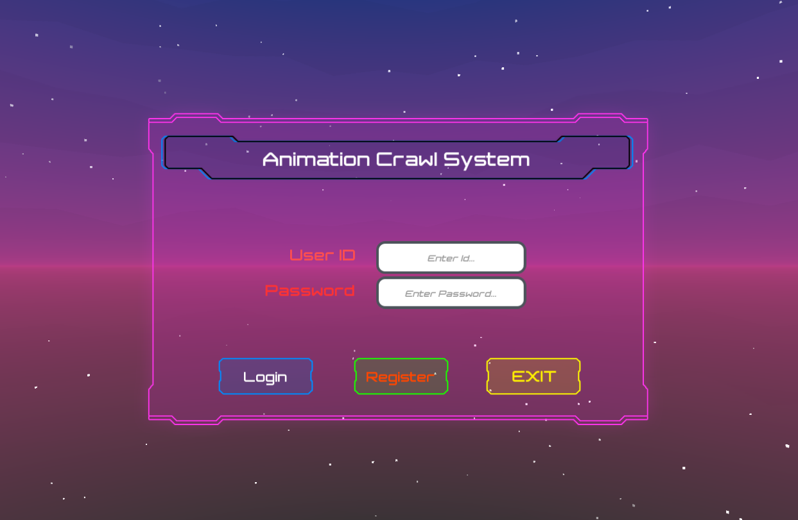
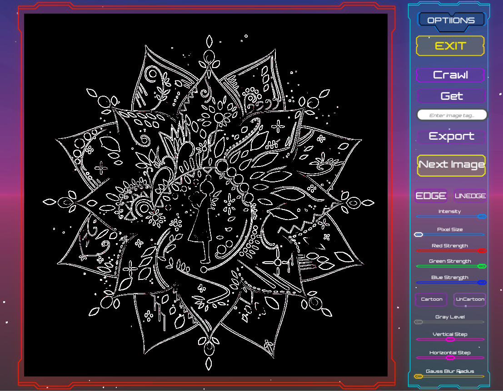

# Animation Crawl System
- This is an animation crwal system front head created with Unity

- Unity version: 2019.4.0f1
- Plantform: Windows Only

## Index

- [Scripts](#scripts)
- [External Packages](#packages)
- [Shaders](#shaders)
- [Usage](#usage)
- [Scene Hierachy](#scene)
- [Preview](#preview)

## Scripts

### Base

- ***PanelManager*** inherited of ***BasePanel***
- **OnInit()[*BasePanel*]** set skinPath and layer.
- **OnShow()[*BasePanel*]** add the event listener of UI.
- **OnClose()[*BasePanel*]** handle the exit event.
- **Init()[*PanelManager*]** set root of gameobject.
- **Open<T>()[*Panelmanager*]** Open a panel you have set.
- **Close()** just close this panel.
- **LoadPrefab()[*ResManager*]** load a prefab from resources folder.

### Moudle Base

- ***JsonBase*** set the data structure of message.
- ***OpenFileDialog*** import a dll[*Comdlg32.dll*] to open windows window and return the path you choose.

### Common Panels

- ***UIPanel*** is a base panel(main interface) of program. you can add some UI elements in this gameobject and handle them in script.
- ***ExportPanel*** just export the image into local folder.
- ***TipPanel*** open a tip(you can set the message you want to show). When OK button is clicked, this panel will close.
- ***LoginPanel/RegisterPanel*** handle user login message. 

### Main

- ***GameMain*** init this program and open ***LoginPanel***.
- ***GlobalSettings*** just handle properties of shader[*Shaders/ImProcessing.shaderlab*]. You can use Slider, InputField, etc to control these properties of shader.

## External Packages

- Comdlg32.dll(Windows only)
- Newtonsoft.Json.dll
- Newtonsoft.Json.dll.mdb

## Shaders

- Only use one shader[ImProcessing.shaderlab]
- most processing is in fragment shader.

### Functions of shader now

- Gauss Blur
- Pixel
- Simple RGB chanel
- Gray Level
- Simple Cartoon
- Edge Sharpen

## Usage

- Clone this project(Unity Version is 2019.4.0f1)
- Open this project with unity(root folder)
- If open fail, you can also download the release[unitypackage] and then import into your project, this package contains the main scene.
- When you want to update, you can replace your local Assets folder with Assets folder in git reporitory.

## Scene hierarchy

### Scene

- With a simple scene, MainSystem of root, Panel/Tip of panels' parent.

### Panel Create

1. Create a root(Empty Gameobject is recommend) of this panel and set root's parent of Panel/Tip.
2. Just create a Canvas and then create your UI elements in it.
3. Create a script of this panel you created. In this script, you need to set the skinPath and layer.
4. When all thing is make down, drag the root into Resources folder to make it prefab, and delete the root in scene hieraochy.
5. To use this panel, just use **PanelManager.Open<PanelType>(para)** in other script.

## Preview

